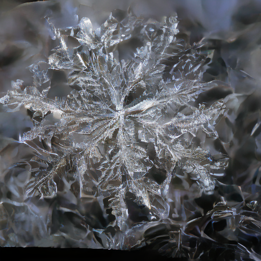
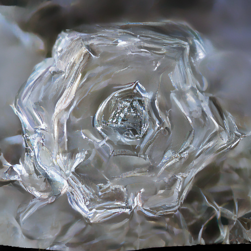
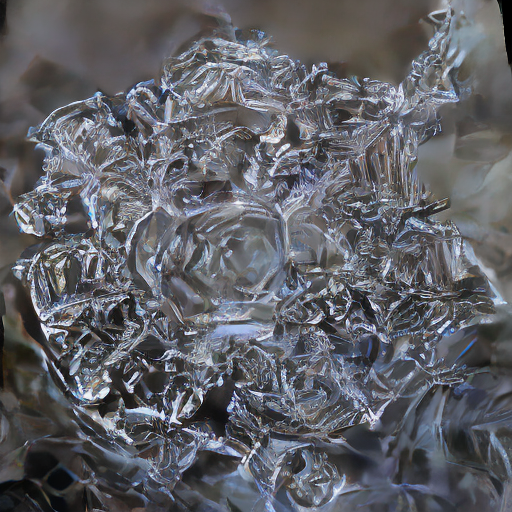
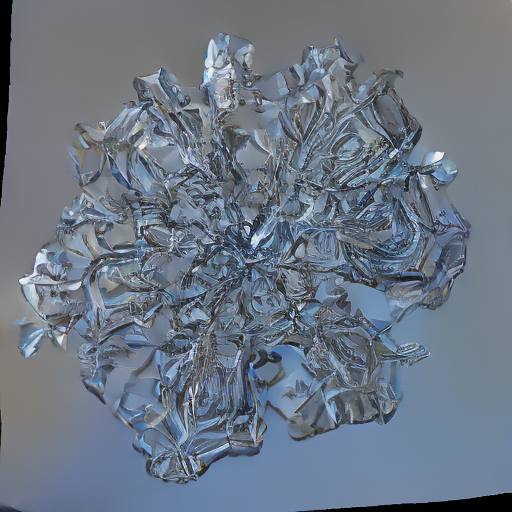
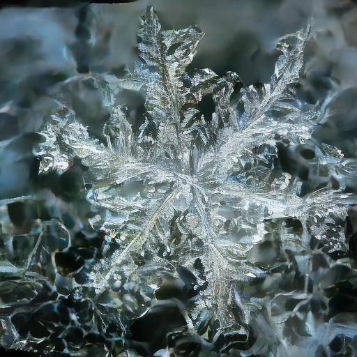
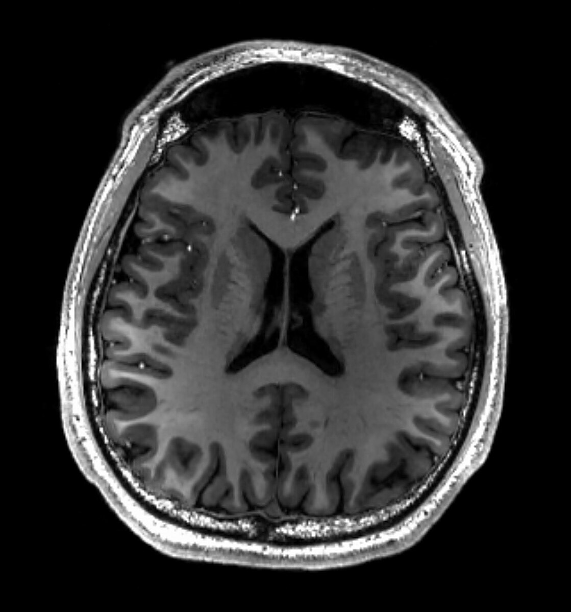
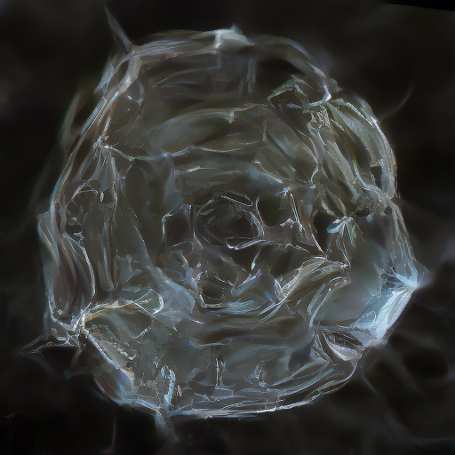

# ❄ Snowflakeizer ❄ 
A web application for generating novel, synthetic snowflake images using a custom unconditional DDPM U-Net model. It can generate images from a random latent space or in image-to-image mode, producing snowflakes based on an encoded and noised input image. 

## About the Model
Snowflakeizer uses a **custom, unconditional DDPM U-Net (EMA)** trained from scratch on a dataset of snowflake photos: ["Macro photos of real snowflakes" by Alexey Kljatov](https://www.flickr.com/photos/chaoticmind75/albums/72157702326145532/) (CC BY).

The model was trained using the [train.py script](https://github.com/dledwon/Snowflakeizer/blob/main/train.py) included in this repository.

The final model is hosted on **Hugging Face** and is downloaded automatically by the application during runtime. For more details, visit the model page: [dledwon/latent-ddpm-unet-ema-snowflakes](https://huggingface.co/dledwon/latent-ddpm-unet-ema-snowflakes).

## Features 
- Generate unique snowflake images from random latents.
- Image2Image mode: modify existing images to produce snowflake variations.
- Web interface built with Flask for easy interaction.
- Set a constant seed and modify parameters for controlling the output image.

## Technologies
- Python 3.10
- Flask
- PyTorch + CUDA
- 🤗 Diffusers
- HTML / CSS / JavaScript for the frontend

## Installation
Follow these steps to set up **Snowflakeizer** locally:

```bash
# Clone the repository
git clone https://github.com/dledwon/Snowflakeizer.git
cd Snowflakeizer

# Create and activate a virtual environment (venv, conda, etc.)

# Install dependencies
pip install -r requirements.txt

# Run the Flask application
python app.py
```

## Usage
1. Open your browser and navigate to <http://localhost:5000>.
2. Choose your mode: **Random Snowflake** or **Image2Snowflake**.
3. Upload an image for **Image2Snowflake** mode.
4. Toggle between **Random** and **Fixed seed**, set a constant seed number.
5. Adjust generation parameters: number of steps and strength.
6. Click Generate and view/download the resulting image.

## Examples

### Random Snowflake
<p>
  
  
  
  
  
</p>

### Image2Snowflake
Original image:  


Generated snowflake:  

